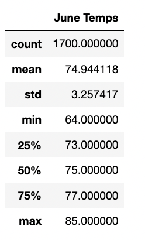

# Surfs Up Analysis 

## Overview of the Analysis
In the initial analysis, ran analytics using SQLite, SQLAlchemy, Flask, Pandas and Python on a weather dataset for Oahu, Hawaii to hopefully have investor, W. Avy invest in a Surf n' Shake shop.

The initial analysis of the weather in Oahu can be found in the [climate_analysis](climate_analysis.ipynb) file. 

W. Avy likes the analysis, but he wants more information about temperature trends before opening the surf shop. Specifically, he wants temperature data for the months of June and December in Oahu, in order to determine if the surf and ice cream shop business is sustainable year-round.

The purpose of the analysis is to find summary statistics of the temperature in Oahu for June and December. 

## Analysis Process

### Determined the Summary Statistics for June 
Used Python, Pandas functions and methods, and SQLAlchemy, to filter the date column of the Measurements table in the hawaii.sqlite database to retrieve all the temperatures for the month of June. Then converted those temperatures to a list, created a DataFrame from the list, and generated the summary statistics.

For more information on how this was done, please see the [SurfsUp_Challenge](SurfsUp_Challenge.ipynb) file. 

### Determined the Summary Statistics for December 
Used Python, Pandas functions and methods, and SQLAlchemy, to filter the date column of the Measurements table in the hawaii.sqlite database to retrieve all the temperatures for the month of December. Then converted those temperatures to a list, created a DataFrame from the list, and generated the summary statistics.

For more information on how this was done, please see the [SurfsUp_Challenge](SurfsUp_Challenge.ipynb) file. 

## Results
After running the analysis the following summary statistics tables were created. 

For June: 

For December:

From the summary statistics, the following observations can be noted:
* the average temperature in Oahu is warmer in June than in December. June had an average tempearture of 74.9 degrees Fahrenheit while December had an average temperature of 71.0 degrees Fahrenheit.

* There is slightly more dispersion of the temperatures in December than in June. December temperatures had a standard deviation of 3.7 while June had a standard deviation of 3.3. 

* December also has a lower minimum temperature and max temperature than June. In December, the minimum temperature was 56 degrees Fahrenheit while the maximum temperature was 83 degrees Fahrenheit. In June the minimum temperature was 64 degrees Fahrenheit while the maximum temperature was 85 degrees Fahreneit.  

* One thing to note is that there are 1,700 temperature observations in June and only 1,517 temperature observations in December. This may slightly skew the results for comparison. 

## Summary
Overall, it appears that June would be the better month for sales,since it is warmer and there is less variance in the temperature throughout the month. However December is still fairly warm in comparison. The average temperatures only differ by about 4 degrees. The sales may drop slightly, but not significantly. 

Another area w. Avy may want to observe is precipitation in June and December. Two additional queries were run to find the summary statistics of precipitation in June and December. 

For more information on how the additional queries were run, please see the [SurfsUp_Challenge](SurfsUp_Challenge.ipynb) file. 

Below are the precipitation summary statistic tables. 

For June: 

For December:

From the above it can be observed that on average June has less precipitation than December. June had average precipitation of 0.14 while December had an average of 0.22. There is also more spread in the amount of precipitation observations for December than June (December's standard deviation was 0.54 while June was 0.33). December also had a maximum precipitation observation of 6.4 while June had 4.4. 

This further supports the fact that June may be more profitable for the business, as there is less rain in June than December. Customers are less likely to go surfing and buy ice cream when it is colder and when it is raining. However, as mentioned above, the statistics are fairly close. I think when observing the statistics for both months, it is fair to say the business would be generally succcesful in both months, when considering weather. 